import { Card, LinkButton } from '@astrojs/starlight/components';

<Card title="Interactive Roadmap">
  
</Card>

  <LinkButton href="/mind-map-en/advanced.png" target="_blank" icon="external">
    View High-Resolution PNG (10,000px)

```mermaid
graph LR
 
Root[Advanced Section]

%% New Technologies
Root --> NT[New Technologies]
NT --> Java8[Java 8]
Java8 --> J8L[Lambda Expressions]
Java8 --> J8S[Stream API]
Java8 --> J8T[Time API]
NT --> Java9[Java 9]
Java9 --> J9J[Jigsaw]
Java9 --> J9S[Jshell]
Java9 --> J9R[Reactive Streams]
NT --> Java10[Java 10]
Java10 --> J10V[Local Variable Type Inference]
Java10 --> J10G[Parallel Full GC for G1]
Java10 --> J10T[ThreadLocal Handshake Mechanism]
NT --> Java11[Java 11]
Java11 --> J11Z[ZGC]
Java11 --> J11E[Epsilon]
Java11 --> J11V[Enhanced var]
NT --> Spring6[Spring 6.x / Spring Boot 3.x]
Spring6 --> S6N[GraalVM Native Images]
Spring6 --> S6O[Observability / Micrometer]
NT --> JavaLTS[Modern Java LTS]
JavaLTS --> J17[Java 17: Sealed Classes, Pattern Matching]
JavaLTS --> J21[Java 21: Virtual Threads, Sequenced Collections]
JavaLTS --> J25[Java 25: Scoped Values, Structured Concurrency]
NT --> HTTP[Protocols]
HTTP --> H2[HTTP/2]
HTTP --> H3[HTTP/3]

%% Performance Optimization
Root --> PO[Performance Optimization]
PO --> PO1[Using Singletons]
PO --> PO2[Using Future Pattern]
PO --> PO3[Using Thread Pools]
PO --> PO4[Selector Readiness]
PO --> PO5[Reducing Context Switching]
PO --> PO6[Reducing Lock Granularity]
PO --> PO7[Data Compression]
PO --> PO8[Result Caching]

%% Online Problem Analysis
Root --> OPA[Online Problem Analysis]
OPA --> Dump[Dump]
Dump --> D1[Thread Dump]
Dump --> D2[Memory Dump]
Dump --> D3[gc Status]
Dump --> D4[Analyzing Deadlocks]
Dump --> D5[Analyzing Memory Leaks]
OPA --> Tools[Acquisition & Analysis Tools]
Tools --> T1[jstack]
Tools --> T2[jstat]
Tools --> T3[jmap]
Tools --> T4[jhat]
Tools --> T5[Arthas]
OPA --> OOM[OOM & StackOverflow]
OOM --> O1[HeapOutOfMemory]
OOM --> O2[Young OutOfMemory]
OOM --> O3[MethodArea OutOfMemory]
OOM --> O4[ConstantPool OutOfMemory]
OOM --> O5[DirectMemory OutOfMemory]
OOM --> O6[Stack OutOfMemory Stack OverFlow]
OPA --> ArthasDetail[Arthas Details]
ArthasDetail --> AD1[JVM-related]
ArthasDetail --> AD2[Class/ClassLoader-related]
ArthasDetail --> AD3[Monitor/Watch/Trace-related]
ArthasDetail --> AD4[options/Pipes]
ArthasDetail --> AD5[Background Async Tasks]
OPA --> Approach[Problem Solving Approaches]
Approach --> A1[Memory Overflow]
Approach --> A2[Thread Deadlock]
Approach --> A3[Class Loading Conflict]
OPA --> Exercises[Troubleshooting Exercises]
Exercises --> E1[Slow Response]
Exercises --> E2[Frequent FullGC]
Exercises --> E3[GC Logs]
Exercises --> E4[OOM Application]
Exercises --> E5[Deadlock Check]
Exercises --> E6[Memory Leak Check]
Exercises --> E7[Spring Boot 404/401]
Exercises --> E8[Log Flooding]
Exercises --> E9[NoSuchMethodError]

%% Compilation Principles
Root --> CP[Compilation Principles]
CP --> CDe[Compilation & Decompilation]
CDe --> CD1[Java Code Comp/Decomp]
CDe --> CD2[Tools: javap, jad, CRF]
CP --> JIT[Just-In-Time Compiler]
JIT --> JIT1[Lexical/Syntax/Semantic Analysis]
JIT --> JIT2[Process: Runtime, Intermediate Code, Gen, Opt]

%% Operating System
Root --> OS[Operating System]
OS --> OS1[Common Linux Commands]
OS --> OS2[Inter-process Communication]
OS --> OS3[Process Synchronization: Producer-Consumer, Philosophers, Readers-Writers]
OS --> OS4[Buffer Overflow]
OS --> OS5[Segmentation and Paging]
OS --> OS6[Virtual Memory & Main Memory Management]
OS --> OS7[Page Replacement Algorithms]

%% Database
Root --> DB[Database]
DB --> MyE[MySQL Engine & Plan]
MyE --> ME1[Execution Engine]
MyE --> ME2[Execution Plan View & Opt]
DB --> Index[Index]
Index --> I1[Hash Index]
Index --> I2[B-Tree/B+ Tree/R-Tree]
Index --> I3[Normal/Unique/Covering Index]
Index --> I4[Leftmost Prefix Rule]
Index --> I5[Index Condition Pushdown]
DB --> SQLOpt[SQL Optimization]
DB --> Trans[Transactions & Locks]
Trans --> T1_ACID[ACID & Isolation Levels]
Trans --> T2_Lock[Row/Table/Shared/Exclusive/Optimistic/Pessimistic]
DB --> Replication[Replication & binlog/redolog]
DB --> MemDB[In-memory DB: h2]
DB --> Scalability[Sharding & Read-Write Splitting]
DB --> NoSQL[NoSQL: redis, memcached]
DB --> DistLock[Distributed Lock: DB/NoSQL]
DB --> Tuning[Performance Tuning & Conn Pool]

%% Data Structures and Algorithms
Root --> DSA[Data Structures & Algorithms]
DSA --> SD[Simple Data Structures: Stack, Queue, Linked List, Array, Hash Table]
DSA --> Tree[Tree]
Tree --> T1_B[Binary/Balanced/Sort Tree]
Tree --> T2_M[Trie/B-Tree/B+ Tree/R-Tree/Multi-way/Red-Black]
DSA --> Heap[Heap: Max/Min]
DSA --> Graph[Graph: Directed/Undirected/Topology]
DSA --> Sort[Sorting Algorithms]
Sort --> SS[Stable: Bubble, Insert, Merge, Radix, etc.]
Sort --> US[Unstable: Select, Shell, Heap, Quick, etc.]
DSA --> Search[Search & Traversal: DFS, BFS, KMP]
DSA --> Other[Other: Greedy, Permutations, Hash, Massive Data, Stack/Queue Impl]

%% Big Data
Root --> BD[Big Data]
BD --> ZK[Zookeeper: Concepts & Usage]
BD --> BSearch[Search: Solr, Lucene, Elasticsearch]
BD --> Stream[Stream Computing: Storm, Spark, S4]
BD --> Hadoop[Hadoop: HDFS, MapReduce]
BD --> Log[Log Collection: flume, kafka, logstash]
BD --> Mining[Data Mining: mahout]

%% Network Security
Root --> Security[Network Security]
Security --> Attacks[Attacks: XSS, CSRF, Injection, File Upload, DDoS]
Security --> Crypto[Encryption & Decryption]
Crypto --> C1[Symmetric/Asymmetric/Hash/Salted]
Crypto --> C2[Algorithms: MD5, SHA1, DES, AES, RSA, DSA]
Crypto --> C3[Rainbow Table]
Security --> Protocols[Security Protocols: SSL, TLS, HTTPS]
Security --> Servers[HTTPS Server: Apache/Nginx + OpenSSL]
```

  </LinkButton>

View Mermaid Source

