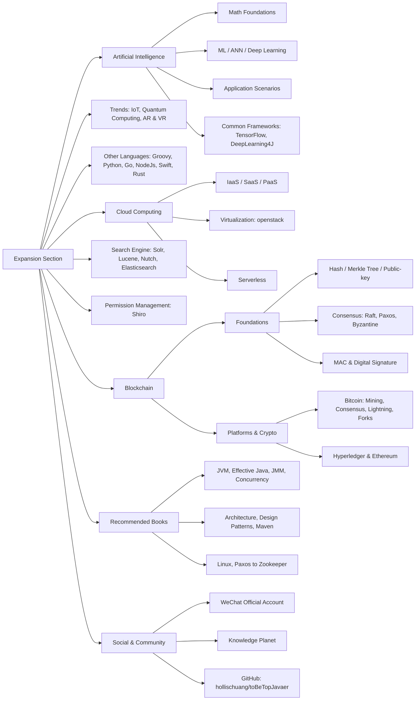

import { Card, LinkButton } from '@astrojs/starlight/components';

<Card title="Interactive Roadmap">
  
</Card>

  <LinkButton href="/mind-map-en/extensions.png" target="_blank" icon="external">
    View High-Resolution PNG (10,000px)
  </LinkButton>

View Mermaid Source

